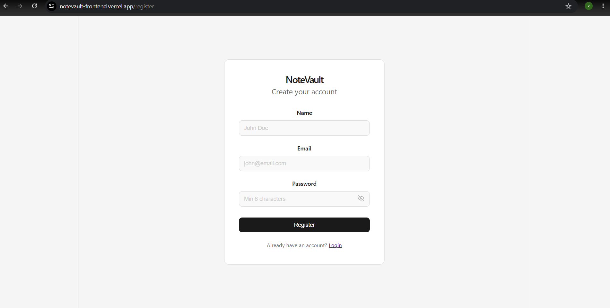
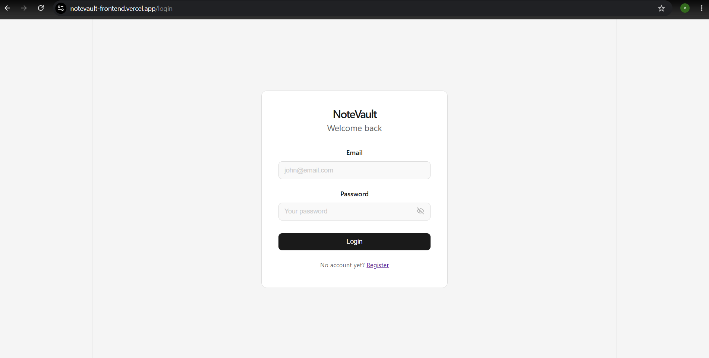
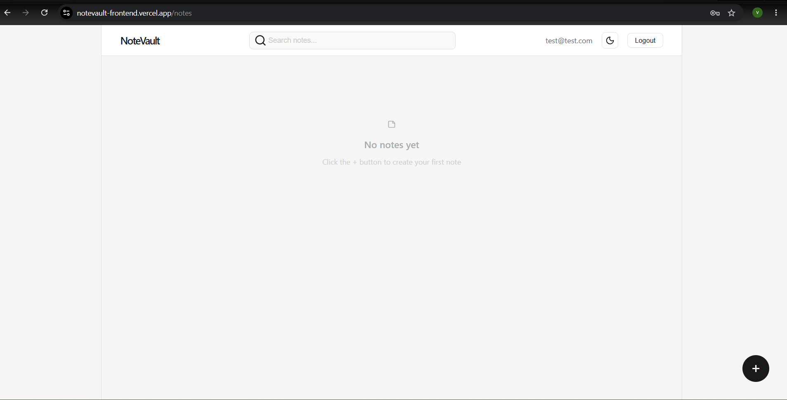
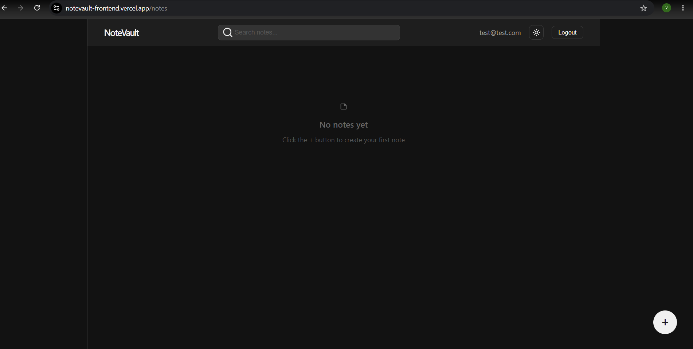
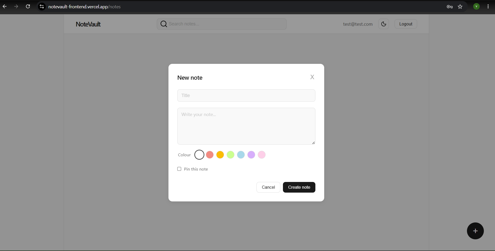
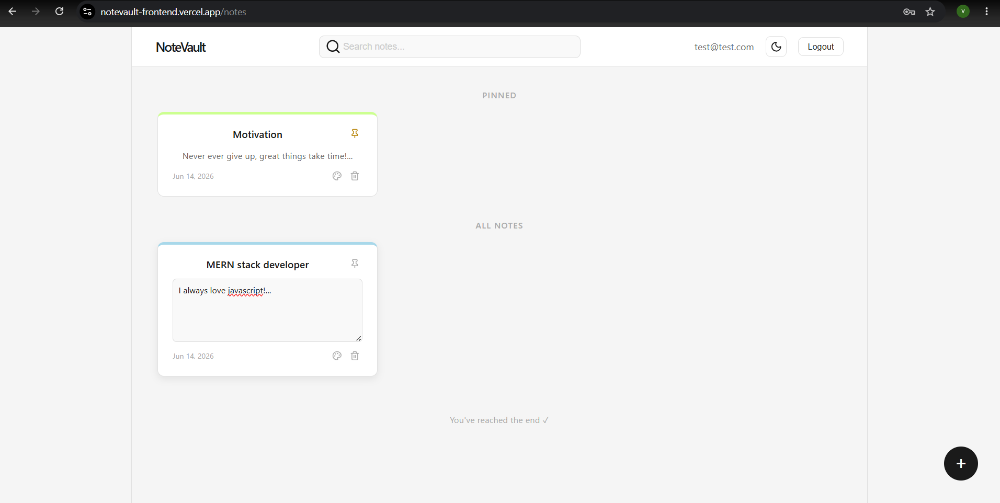
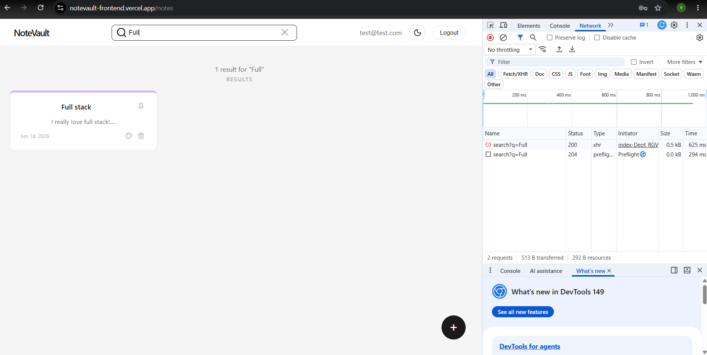
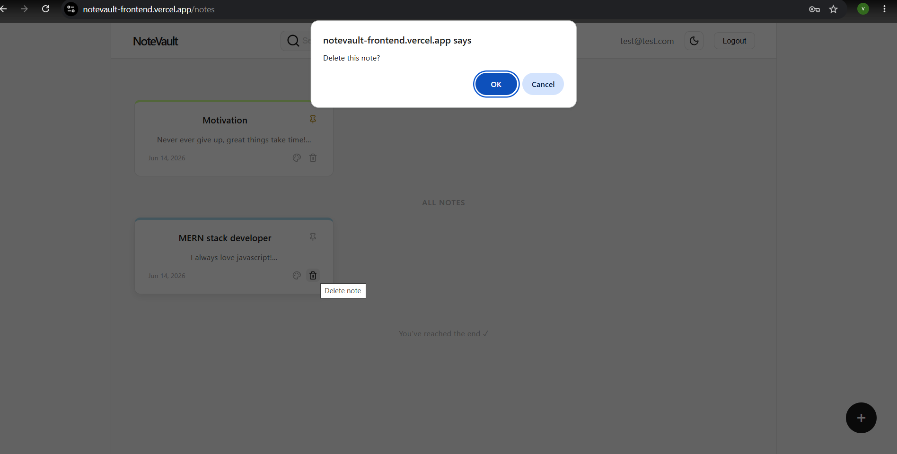
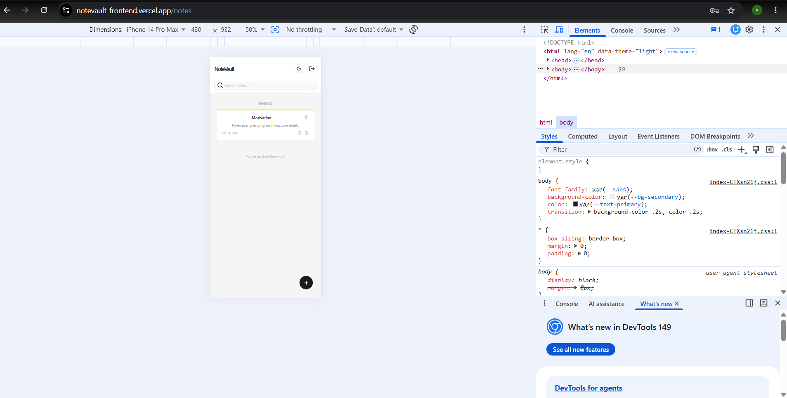

NoteVault — Frontend

🔗 **Live demo:** [notevault-frontend.vercel.app](https://notevault-frontend.vercel.app)

A clean, minimal notes app frontend built with React, React Router v6, and Context API. Connects to the NoteVault backend for authentication and note management.

## Screenshots

Features

JWT Authentication — Register, login, and persistent sessions via localStorage
Protected Routes — /notes is only accessible when logged in
Create, Edit, Delete Notes — Full CRUD with inline editing and auto-save
Pin Notes — Pinned notes are sorted to the top automatically
Colour Tagging — Assign a colour to each note for visual organization
Search — Debounced live search across title and content
Infinite Scroll — Notes load progressively using Intersection Observer
Dark / Light Theme — Theme toggle with persistent preference
Session Expiry Handling — Automatic logout and redirect on token expiry

Tech Stack

Layer               Technology
UI Library          React 18
Routing             React Router v6
State Management    Context API (AuthContext, ThemeContext)
HTTP Client         Axios (with interceptors)
Styling             CSS Modules + CSS Variables
Icons               lucide-react
Build Tool          Vite

Project Structure

src/
├── api/
│   └── axiosInstance.js       # Axios instance with auth + 401 interceptors
├── components/
│   ├── Navbar.jsx
│   ├── NoteCard.jsx
│   ├── CreateNoteModal.jsx
│   ├── EmptyState.jsx
│   └── ProtectedRoute.jsx
├── context/
│   ├── AuthContext.jsx        # JWT storage, login/logout
│   └── ThemeContext.jsx       # Light/dark theme toggle
├── hooks/
│   ├── useFetch.js
│   ├── useDebounce.js
│   ├── useInfiniteNotes.js
│   └── useIntersectionObserver.js
├── pages/
│   ├── Login.jsx
│   ├── Register.jsx
│   └── Notes.jsx
├── styles/
│   └── Auth.module.css
├── App.jsx
├── main.jsx
└── index.css

Getting Started

Prerequisites

Node.js 18+
NoteVault backend running locally on http://localhost:5000

Installation

bashgit clone https://github.com/Viswanath95/notevault-frontend.git
cd notevault-frontend
npm install

Environment Setup

Update the base URL in src/api/axiosInstance.js if your backend runs on a different port:

jsconst api = axios.create({
    baseURL: 'http://localhost:5000/api',
})

Run the development server

bashnpm run dev

The app will be available at http://localhost:5173.

Build for production

bashnpm run build

Routes

Route       Access        Description
/login      Public        Login page
/register   Public        Registration page
/notes      Protected     Notes dashboard

Key Concepts

Authentication flow

JWT token is stored in localStorage upon successful login/register and attached automatically to every API request via an Axios request interceptor. If the token expires (401 response), the user is logged out and redirected to /login with a session-expired message.

Theming

Theme preference (light / dark) is stored in localStorage and applied via a data-theme attribute on <html>. All colours are defined as CSS variables in index.css.

Infinite scroll

Notes are fetched in pages of 6 from the backend. An IntersectionObserver watches a sentinel element at the bottom of the notes list and triggers the next page fetch when it enters the viewport.
